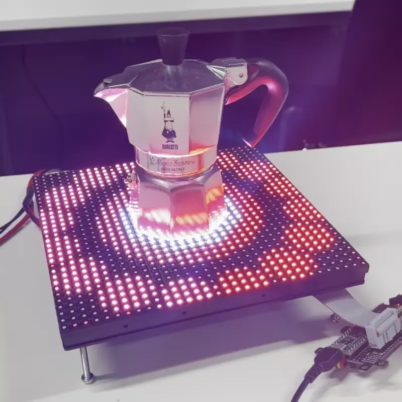

# Dance of the Mokka

Dance of the Mokka is an art project made in processing that shows different scenes that highlight the Bialetti Mokka pot in the center. The scenes of this project use different shapes, primarily octagons, the base shape of any original Mokka pot from Bialetti. The code can be adapted to feature larger Mokka pots, although it was designed to showcase the 1-cup version on a 32x32 pixel display. Big thanks to Andreas Gysin for helping me create this beautiful piece and introducing me to the world of processing.

Arduino, Processing and other assets are stored in the folder `assets`.
