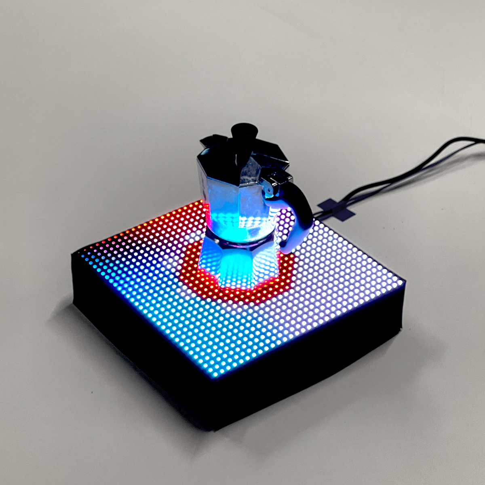

# Dance of the Moka

Dance of the Moka is an art project made in processing that shows a choreography on a 32x32 LED matrix to highlight a Bialetti Moka pot positioned on top of it. The scenes use different shapes, primarily octagons - the base shape of any original Moka pot from Bialetti. The code can be adapted to feature larger Moka pots, although it was designed to highlight the 1-cup version. Big thanks to [Andreas Gysin](https://ertdfgcvb.xyz/) for helping me create this beautiful piece and introducing me to the world of processing.

Arduino, Processing and other assets are stored in the folder `assets`.

## About the Project

The choreography of Dance of the Moka was designed to consistently attract the user to the object positioned in the middle. Some scenes will rotate, some will pulse, while others will explode. Most scenes involve intense colors. There is one scene showcasing the brand Bialetti to let the user feel that this choreography was designed on purpose for the Bialetti pot. The last scene shows a pixelated picture of coffee beans. The animations involved in this project are generated with Processing (i.e., no prerecorded video or photos, except for the logo and coffee beans image).

## Demo & Processing Recording

Below you can see my favorite animation of the choreo and the actual animations created with Processing.

## More Previews

And some more pictures of the project in action.

